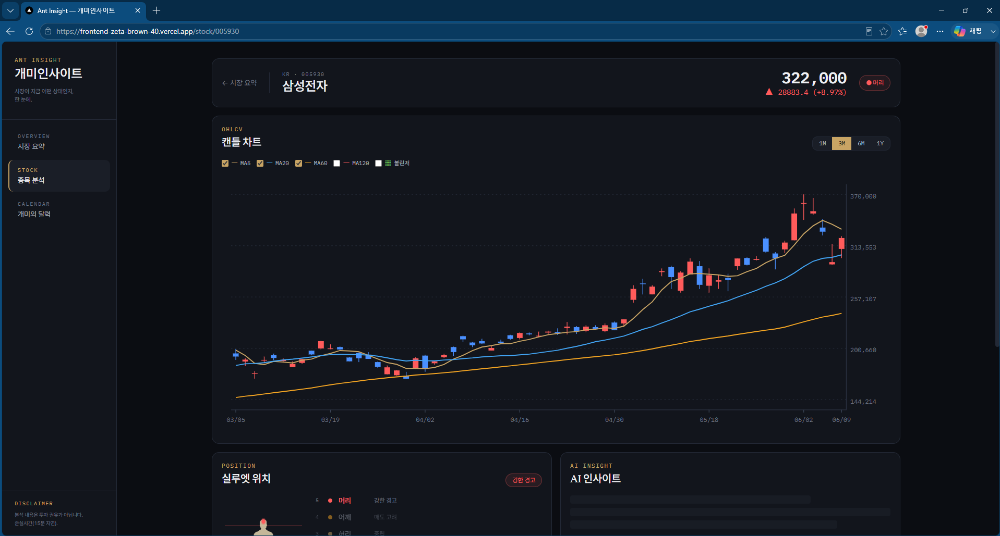
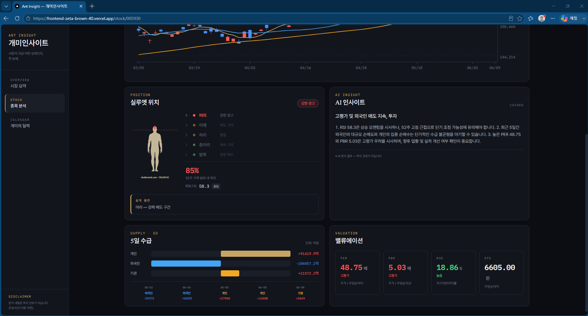

# Ant Insight — 개미 투자자를 위한 시장·종목 대시보드

> 흩어져 있는 투자 정보(환율·공포탐욕지수·주요 지수·종목 기술지표·AI 인사이트)를 한 화면에 모아 보여주는 웹 대시보드입니다. FastAPI 백엔드 + Next.js 프론트엔드로 만든 **2인 팀 프로젝트**입니다.

## 담당 역할

2인 팀이며, 제가 담당한 부분은 **종목 상세 기능 전체(백엔드 서비스 ~ 프론트엔드)** 입니다.

| 영역 | 담당 | 내용 |
| --- | --- | --- |
| 종목 상세 (기술지표·실루엣·밸류에이션·수급·AI 인사이트) | **본인** | 백엔드 `indicator`·`silhouette`·`gemini` 서비스 + `stock`·`insight` 라우터, 프론트 캔들·수급·밸류에이션·실루엣·AI 인사이트 컴포넌트, Next.js 초기 세팅 |
| 홈 대시보드(환율·공포탐욕·지수·버핏지수/M7)·투자 캘린더·배포 | 팀원 | 백엔드 `market`·`calendar` 라우터, 홈 화면, Vercel/Railway 배포 |

> 역할 분담은 `Implementation_list.md`, 공유 명세는 `DEV_SPEC.md`에 정리되어 있고, 각자 기여는 커밋 히스토리로 확인할 수 있습니다.

## 데모

제가 담당한 **종목 상세** 화면입니다. 종목을 고르면 기술지표·실루엣·수급·밸류에이션·AI 인사이트를 한 페이지에서 보여줍니다.

> 배포 데모는 외부 데이터 미연결 시 샘플(Mock) 데이터로 동작합니다.

## 주요 기능 (담당 부분)

- **기술지표** — MA(5/20/60/120), 볼린저밴드, RSI(14). RSI는 단순평균이 아니라 **Wilder's(RMA) 방식**, 볼린저는 모집단 표준편차로 계산해 **HTS·TradingView가 쓰는 표준 계산식과 같은 값**이 나오도록 구현했습니다.
- **실루엣 5구간** — 52주 고저 대비 현재가 위치를 발목/무릎/허리/어깨/머리 5단계로 분류하고, RSI로 과매수·과매도를 보정해 표시합니다.
- **AI 인사이트** — 종목 데이터(지표·실루엣·밸류에이션·수급)를 Gemini 2.5 Flash에 넘겨 한 줄 요약과 3줄 근거를 생성합니다. JSON 형식 강제·파싱 방어·1시간 캐시·호출 실패 시 Mock 폴백·면책 문구를 함께 둡니다.
- **종목 상세 화면** — 캔들차트(MA·볼린저), 수급, 밸류에이션(PER/PBR/ROE/EPS), 실루엣 패널, AI 인사이트를 한 페이지에 구성했습니다.

## 기술 스택

| 영역 | 사용 기술 |
| --- | --- |
| 백엔드 | Python, FastAPI, pandas, numpy |
| 데이터 | pykrx, yfinance |
| AI | Google Gemini (`google-genai`, gemini-2.5-flash) |
| 프론트엔드 | Next.js (App Router), TypeScript |
| 배포 | Vercel(프론트) · Railway(백엔드) |

## 한계

- **정보 집계 중심** — 흩어진 지표를 한 화면에 모으는 데 초점이 있어, 리밸런싱 같은 직접적인 자산관리·투자 보조(액션) 기능은 없습니다.
- **주식 위주** — 채권·금 등 안전자산이나 금리 같은 매크로 지표는 제한적으로만 다룹니다.
- **외부 데이터 의존** — 실데이터는 pykrx·yfinance에 의존하며, 미연결·실패 시 Mock으로 폴백합니다(서비스는 끊기지 않지만 표시값이 실시간이 아닐 수 있습니다).
- **AI 인사이트는 참고용** — Gemini 생성 결과로 투자 권유가 아니며(면책 문구 고정), 환각 가능성이 있습니다.
- **규칙 기반 신호** — 실루엣 구간·RSI 보정 기준은 백테스트로 검증된 매매 신호가 아니라 해석을 돕는 휴리스틱입니다. 지표·인사이트 품질을 정량 평가하지는 않았습니다.

## 배운 점

- **익숙한 도구와 같은 값을 보장한다** — RSI·볼린저를 자체 방식이 아니라 HTS·TradingView가 쓰는 표준 계산식(Wilder RSI, 모집단 표준편차)으로 구현했습니다. 투자자가 늘 보던 도구와 값이 다르면 지표를 신뢰하기 어렵다고 봤기 때문입니다.
- **실패를 사용자에게 그대로 노출하지 않는다** — Gemini 호출·파싱이 실패해도 원시 에러가 화면에 나가지 않게 Mock으로 폴백하고, AI 생성물이라는 면책을 항상 붙였습니다. 외부 LLM을 제품에 쓸 때는 정상 경로만큼 실패 경로와 표기를 함께 설계해야 한다는 걸 익혔습니다.
- **명세를 맞추되, 명세에 적기 전에 검증한다** — 예전에 기술 명세 없이 진행했다 고생한 적이 있어, 이번엔 사소한 버전까지 명세서에 적고 둘이 맞춰 협업해 큰 충돌 없이 진행했습니다. 다만 KRX 데이터 연동이 실제로 되는지 확인하지 않고 명세에 먼저 적었다가 바로잡는 데 시간을 썼고, 명세에 적는 가정도 먼저 검증해야 한다는 걸 다시 느꼈습니다.
